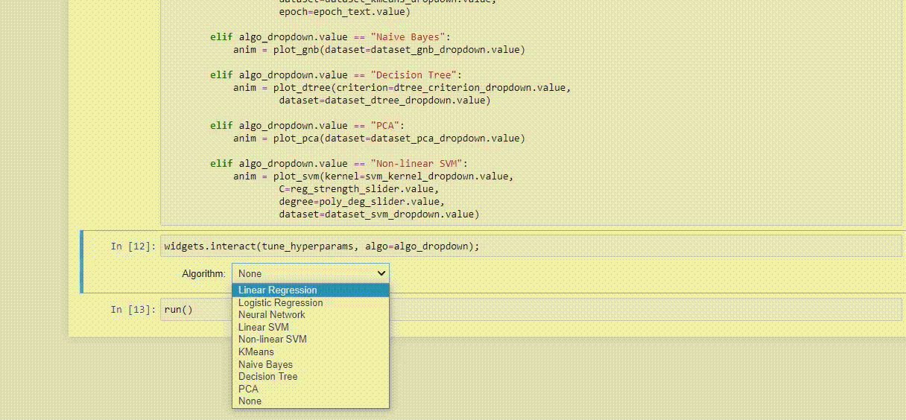

<div align="center">
    <h1>ML Algorithm Visualizer</h1>
<!-- 


 -->

 &nbsp;
 &nbsp;
 &nbsp;
 &nbsp;
 &nbsp;
 &nbsp;
</div>

Humans are visual learners. The human brain is not well-equipped to process a large corpus of data but is rather good at identifying changes and patterns visually. If you’re given a large paragraph of text describing a scenario and a picture of that scenario for the same amount of time, then you would retain more information from the visual object i.e. the picture. We believe the learning system in engineering should also be fundamentally structured around visualizing the problem domain first, and then, if necessary, be supplemented by texts.

Emphasizing the need for visualization, we envision developing software that would visualize learning algorithms specified by the users and serve as a learning aid to anyone interested in Machine Learning. The algorithms that are visualized:

>- Linear Regression
>
>- Logistic Regression
>
>- Neural Network
>
>- Linear Support Vector Machine
>
>- Non-Linear Support Vector Machine
>
>- K-means
>
>- Naive Bayes
>
>- Decision Tree
>
>- Principal Component Analysis

<div align="center">
    
</div>

## Getting Started

### Creating an environment (recommended)

**Using Anaconda**

```
conda create -n ENV_NAME python=3.7
```

Where `ENV_NAME` is the name of the environment. After creating the environment, activate it using:

```
conda activate ENV_NAME
```

**Using venv**

```
python3 -m venv ENV_NAME
```

Where `ENV_NAME` is the name of the environment. After creating the environment, activate it using:

```
source ENV_NAME/bin/activate
```

### Installing requirements

Install all the requirements from `requirements.txt` using:

```
pip install -r requirements.txt
```

### Running the program

Open `Visualizer.ipynb` and run all cells.

## Contributors

- <a  href="https://github.com/tauseef09"> Tauseef Tajwar</a>

- <a  href="https://github.com/farhanishmam"> Farhan Ishmam</a>

- <a  href="https://github.com/Muftiqur1111"> Muftiqur Rahman</a>

- <a  href="https://github.com/ishmamt"> Ishmam Tashdeed</a>
